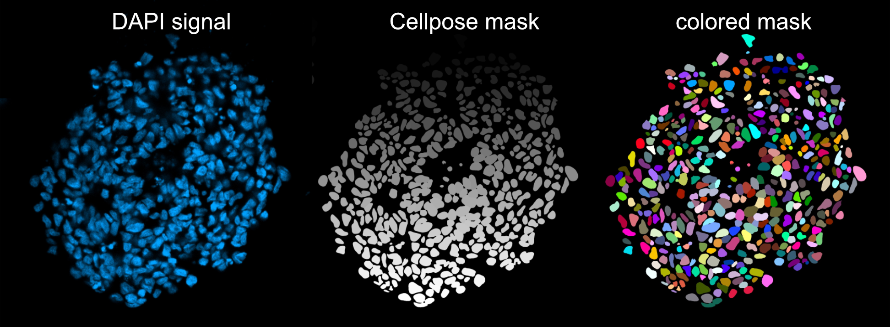

# Pipeline Overview

## Objective

This pipeline is designed to quantify the expression of nuclear markers
from immunolabeled confocal microscopy images and to classify individual
nuclei into positive and negative populations based on marker expression
levels.\
The pipeline consists of the following main steps:

1.  **Data preparation:** preprocessing and organization of the input
    data.

2.  **Nuclei segmentation:** identification and segmentation of
    individual nuclei from the microscopy images.

3.  **Signal quantification:** measurement of the nuclear signal
    intensity for each marker.

4.  **Threshold selection:** determination of the intensity threshold
    used to distinguish marker-positive from marker-negative nuclei.

5.  **Cell classification and quantification:** classification of
    individual nuclei into positive and negative populations and
    calculation of the proportion of cells in each population.

## Files structure

The general structure of the project is as follows:

    Quantification/
    |
    |-- README.pdf
    |
    |-- config.yaml
    |
    |-- scripts/
    |   |-- config.py
    |   |-- 01_rename_files.py
    |   |-- 02_sort_Airy_RAW.py
    |   |-- 03_split_czi.py
    |   |-- 04_segmentation.py
    |   |-- 04b_control_segmentation.py
    |   |-- 05_quantification.py
    |   |-- 05b_plot_intensity_distribution.py
    |   |-- 06_threshold.py
    |   |-- 06b_plot_thresholds.py
    |   |-- 07_classification.py
    |   |-- 07b_control_classification.py
    |   |-- 08_plot_quantif.py (pas terminé)
    |

# Scripts description

This section describes the role of each of the pipeline scripts.

## `config.yaml`

This file contains the tunable parameters of the pipeline:

    cellpose:
        model: "cpsam_v2"      # model cellpose
        diameter: 120          # average nuclear diameter in pixels
        flow_threshold: 0.4    
        cellprob_threshold: 1  

## `config.py`

This script contains the function to access the configuration parameters
of `config.yaml`:

        def load_config():

        config_path = Path(__file__).parent.parent / "config.yaml"

        with open(config_path, "r", encoding="utf-8") as file:
            return yaml.safe_load(file)

## `01_rename_files.py`

### Objective

This script allows you to rename files to comply with naming
conventions. Images naming convention : `DiffName_Day_Clone_*` ;
example: `LD6_J9_WT_DAPI_PAX3_OLIG3_SOX10_1-Airyscan Processing`.

### Input

Folder containing the files to rename.

### Process

The script performs the following operations:

1.  Open a dialogue interface to specify the text to be replaced and the
    replacement text.

2.  Rename all the files from the input folder.

### Output

The folder now contains the renamed files.

## `02_sort_Airy_RAW.py`

### Objective

This script sorts the raw images from the airy-scan processed images.

### Input

Folder containing the files to rename.

### Process

1.  Open a window to select the input folder.

2.  Create the two output folders: `Airyscan_processed` and `RAW`.

3.  Sort the images whose filenames contain \"Airyscan\" in the
    `Airyscan_processed` folder and the other images in the `RAW`
    folder.

### Output

- `Airyscan_processed` folder containing the Airy-scan processed images.

- `RAW` folder containing the RAW images.

## `03_split_czi.py`

### Objective

This script splits the CZI images into individual channel images
(.tiff).

### Input

Folder containing the czi images to split.

### Process

1.  Open a window to select the input folder.

2.  Detect the number of channels in the czi files.

3.  Open a dialogue interface to specify the name of each channel.

4.  Split the czi images into individual channel tiff images.

5.  Save the images in the output folder `images_tiff` with the
    specified name as a suffix: `"_MarkerName"`.

### Output

`images_tiff` folder containing the individual channel tiff images.

## `04_segmentation.py`

### Objective

This script performs nuclear segmentation using the DAPI signal and the
Cellpose segmentation model. The parameters (Cellpose model, average
nucleus diameter \...) can be configured in the `config.yaml` files.

### Input

Folder containing the split images (one channel per image).

### Process

1.  Open a window to select the input folder.

2.  Run Cellpose to segment the nuclei.

3.  Save the Cellpose segmentation masks in the output folder:
    `Segmentation`.

### Output

`Segmentation` folder containing the Cellpose segmentation masks.

### `04b_control_segmentation.py`

This script allows you to color the segmentation masks in order to check
that the segmentation is sufficiently accurate. The input is the folder
containing the Cellpose segmentation masks, the script applies the LUT
*Glasbey on dark* to each images from the input folder and saves the
colored masks as jpeg images in a `Control_Segmentation` folder.

<figure data-latex-placement="h">

<figcaption><strong>Fig.1</strong> Exemple of Cellpose segmentation and
mask coloration from DAPI signal of a day 9 spinal
organoid.</figcaption>
</figure>

## `05_quantification.py`

### Objective

This script quantifies mean nuclear fluorescence intensity for each
marker within each segmented nucleus and exports the results with image
and experimental metadata to a CSV file.

### Input

First, the folder containing the Cellpose segmentation masks. Then, the
folder containing the images (the split images for each channel).

### Process

1.  Select input folders: segmentation masks and marker images.

2.  Detect markers from the first image.

3.  Load segmentation masks and marker images for each sample.

4.  Measure mean fluorescence intensity for each segmented nucleus and
    marker.

5.  Extract experimental metadata (differentiation, day, clone,
    condition).

6.  Merge measurements across markers and images.

7.  Export the results as `quantification.csv`.

### Output

A single `quantification.csv` file (cf fig.2).

<figure data-latex-placement="h">

<figcaption><strong>Fig.2</strong> Exemple of a quantification.csv
output file for three markers: OLIG3, PAX3, SOX10.</figcaption>
</figure>

### 05b_plot_intensity_distribution.py

This script generate a density plot of the intensity distributions for
each marker. It takes the quantification CSV file as an input, detect
marker intensity columns automatically and extract nuclear intensity
values for each marker. Then generate the density plots and save them in
the output folder: `Plot_Distribution`.

<figure data-latex-placement="h">

<figcaption><strong>Fig.3</strong> Mean PAX3 nuclear intensity density
plot.</figcaption>
</figure>

## `06_threshold.py`

### Objective

This script displays the intensity distributions for each marker with
draggable thresholds to test an initial threshold for distinguishing
between positive and negative cell populations.

### Input

`quantification.csv` file containing the mean fluorescence intensity for
each segmented nucleus and marker.

### Process

1.  Select the input file.

2.  Automatic marker detection.

3.  Display the intensity distribution for each marker with an initial
    threshold.

4.  Interactive threshold selection (calculate the proportion of +/-
    cells)

5.  Save the thresholds as a csv file.

### Output

A `.csv` file containing the thresholds.

## `07_classification.py`

### Objective

This script assigns each nucleus to a mutually exclusive population
based on its combination of positive markers according to the specified
negative/positive thresholds.

### Input

`quantification.csv` file.

### Process

1.  Select the quantification CSV file.

2.  Automatically detect the markers.

3.  The user enters a positivity threshold for each marker.

4.  Add the thresholds and classify each nucleus as positive or negative
    for each marker.

5.  Assign each nucleus to a mutually exclusive population based on its
    combination of positive markers

6.  Generate a summary for each image, including total nuclei,
    marker-positive counts, and counts for each cell population.

7.  Save the results as `quantification.csv` and
    `quantification_summary.csv`.

### Output

Update the `quantification.csv` file with the specified threshold for
each marker and the classification for each nucleus, and save a
`quantification_summary.csv` file containing the cell numbers per image
for each combination of markers.

<figure data-latex-placement="h">

<figcaption><strong>Fig.4</strong> Exemple of a
quantification_summary.csv output file for three markers: OLIG3, PAX3,
SOX10. (Only a part of the table is represented).</figcaption>
</figure>

### 07b_control_classification.py

This script generates a color-coded classification image showing
positive nuclei in green and negative nuclei in red. The user selects
the segmentation masks to be visually checked. First, the script loads
the quantification table and identifies the analyzed markers. It checks
the correspondence between mask labels and quantified nuclei for each
image and retrieves the positivity threshold and classification for each
marker. Then, it generates the color-coded classification image for each
marker and saves them in the output folder: `Control_Classification`.

<figure data-latex-placement="h">

<figcaption><strong>Fig.5</strong> Immunolabelling and classification
images for three markers: PAX3, OLIG3 and SOX10.</figcaption>
</figure>

### `07c_plot_thresholds.py`

This script generates a density plot of nuclear intensity distributions
with the threshold separating intensities below and above it (positive
and negative nucleus) for each marker. It takes as input the
quantification CSV file, detects marker intensity columns, and the
associated thresholds automatically. Then, it generates the density
plots and saves them in the output folder: `Plot_Thresholds`.

<figure data-latex-placement="h">

<figcaption><strong>Fig.6</strong> Mean PAX3 nuclear intensity density
plot with the selected threshold separeting the negative (red) from
positive (green) nucleus.</figcaption>
</figure>

## `08_plot_quantif.py`

### Objective

This script plots the percentage of positive cells for selected marker,
with individual measurements for each clone, with each point
representing one image.

### Input

`quantification_summary.csv` file.

### Process

1.  Select the quantification summary CSV file.

2.  Specify the marker to analyze and the desired clone order.

3.  Calculate the percentage of positive cells for each image from the
    positive-cell count and total cell count.

4.  Plot individual measurements for each clone, with each point
    representing one image.

5.  Add the mean ± standard deviation (SD) for each clone.

6.  Save the graph as a high-resolution PNG in the same folder as the
    input CSV.

### Output

High-resolution PNG graph in the same folder as the input CSV.

<figure data-latex-placement="h">

<figcaption><strong>Fig.7</strong> Proportion of PAX3+ cells per clone.
Each dot is one image</figcaption>
</figure>

# Installation

With Conda :

    conda create -n quantification_pipeline python=3.11
    conda activate quantification_pipeline

Dependencies can then be installed using:

    pip install -r requirements.txt

# How to use the pipeline

## Run a script

A script can be run from the terminal using:

    python Quantification\scripts\04_segmentation.py

## Pipeline parameters

The configurable parameters are indicated in :

    Quantification\config.yaml

# Author and contact

**Author:** Lucas DENIS

**Lab:** Jacques Monod Insitut, Ribes/Nedelec lab

**Contact:** lucas.denis@ijm.fr

**Last update :** \[2026-09-25\]
